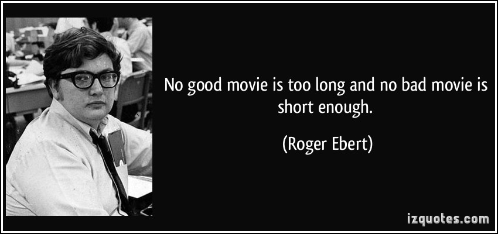

```{r setup, include=FALSE}
knitr::opts_chunk$set(echo = FALSE)
```
## quotes

"The length of a film should be directly related to the endurance of the human bladder."
??? Alfred Hitchcock
"No good movie is too long and no bad movie is short enough."
??? Roger Ebert


```{r}
library(tidyverse)
library(dplyr)
library(ggplot2)
library(RColorBrewer)
```


```{r}
#cristy
all_movies <- read.csv("/Users/cristyreynolds/Desktop/DataScience2401/Final_Project/IMDbmovies.csv", stringsAsFactors = FALSE) 

#allisons 
#all_movies <- read.csv("IMDbmovies.csv")
 
head(all_movies)

all_movies$year <- as.integer(all_movies$year)
 
movies <- all_movies %>% filter(year >= 1980, country == "USA") %>%
    select(original_title, year, genre, duration, votes, country)

 
write.csv(movies, "movies.csv")
 
```


```{r}

head(movies)

by_genre <- movies %>% group_by(genre) %>% summarise(count = n(), maxRunTime = max(duration), avgRunTime = mean(duration) )


movies %>% filter(genre == "Action") %>%
  summarise(maxRunTime = max(duration), avgRunTime = mean(duration))

```
Now we need to categorize each complex sub-genre into one of nine major genres. We will start by using a for loop and "startswith"

```{r}


movies$subgenre <- str_split(movies$genre, "[,]", simplify = TRUE) [,1]


movie_genre <- movies$subgenre

no_animation <- gsub("Animation", "Family", movie_genre)
no_bio <- gsub("Biography", "Drama", no_animation)
no_mystery <- gsub("Mystery", "Crime", no_bio)
no_thriller <- gsub("Thriller", "Horror", no_mystery)
no_fantasy <- gsub("Fantasy", "Sci-fi/fantasy", no_thriller)
no_scifi <- gsub("Sci-Fi", "Sci-fi/fantasy", no_fantasy)
no_action <- gsub("Action", "Action/adventure", no_scifi)
no_music <- gsub("Musical", "music", no_action)
no_adventure <- gsub("Adventure", "Action/adventure", no_music)
no_sport <- gsub("Sport", "Drama", no_adventure)
no_history <- gsub("History", "Drama", no_sport)
no_music <- gsub("Music", "music", no_history)
action <- gsub("Action/adventure", "Action/Adventure", no_music)
music <- gsub("music", "Musical", action)

fixed_movies <- gsub("Sci-fi/fantasy", "Sci-Fi/Fantasy", music)


unique(fixed_movies)
movies$Genre <- fixed_movies


new_movies <- movies %>% filter(Genre != "Documentary") %>% select(original_title, year, Genre, duration, votes)
#unique(new_movies$Genre)
#new_movies %>% arrange(desc(duration))

write.csv(new_movies, "filtered_movies.csv")

```
```{r}

new_movies$time_increment = 0

new_movies$time_increment[new_movies$duration <= 60] = 60
new_movies$time_increment[new_movies$duration > 60 & new_movies$duration <= 75] = 75
new_movies$time_increment[new_movies$duration > 75 & new_movies$duration <= 90] = 90
new_movies$time_increment[new_movies$duration > 90 & new_movies$duration <= 120] = 120
new_movies$time_increment[new_movies$duration > 120 & new_movies$duration <= 150] = 150
new_movies$time_increment[new_movies$duration > 150 & new_movies$duration <= 180] = 180
new_movies$time_increment[new_movies$duration > 180 & new_movies$duration <= 240] = 240
new_movies$time_increment[new_movies$duration > 240 & new_movies$duration <= 300] = 300
new_movies$time_increment[new_movies$duration > 300 & new_movies$duration <= 360] = 360
new_movies$time_increment[new_movies$duration > 360 & new_movies$duration <= 420] = 420

new_movies %>% group_by(time_increment) %>% 
  summarise (count = n()) %>%
  ggplot(aes(x = time_increment, y = count)) + geom_col()

new_movies %>% group_by(time_increment) %>% 
  summarise (count = n()) %>%
  ggplot(aes(x = time_increment, y = count)) + geom_col() +
  coord_cartesian(ylim=c(0,800))


```

##Run Time of Movies in Each Genre, 

```{r fig.align="center", echo = FALSE,fig.width = 20, fig.height = 5}
##Run Time of Movies in Each Genre, 

genre_only <- new_movies %>% group_by(Genre, time_increment) %>% summarise(count = n())
genre_only %>% ggplot(aes(x = Genre, y = count , fill = as.factor(time_increment))) +
  geom_col(position = "fill") + 
  scale_fill_brewer(palette="Paired", name = "Runtime",
                    breaks = c("60", "75", "90", "120", "150", "180", "240", "300", "360", 
                               "420"),
                    labels = c("Under 1:00", "1:00 to 1:15", "1:15 to 1:30", "1:30 to 2:00", "2:00 to 2:30", "2:30 to 3:00", "3:00 to 4:00", "4:00 to 5:00", "5:00 to 6:00", "6:00 to 7:00" )) +
  coord_flip() +
  labs(y = "Percent of Movies", title = "Proportion of Movies\nby Time and Genre\n") +
  theme(plot.title = element_text(hjust = 0.5))
```
Let's take a look at the longest and shortest movies
```{r fig.width = 12, fig.height = 4}
longest = nrow(new_movies)
tenth_longest = longest-10
longest
tenth_longest
new_movies %>%
  arrange(duration) %>% 
  slice(1:10) %>%
  select(original_title, duration, Genre) %>%
  ggplot(aes(x = original_title, y = duration, fill = Genre)) +
  scale_fill_brewer(palette = "Paired") +
  geom_col() +
  coord_cartesian(ylim=c(20,60)) + 
  coord_flip()

new_movies %>%
  arrange(duration) %>% 
  slice(tenth_longest:longest) %>% 
  select(original_title, duration, Genre) %>%
  ggplot(aes(x = original_title, y = duration, fill = Genre)) +
  scale_fill_brewer(palette = "Paired") +
  geom_col() +
  coord_flip()


```

##BOX PLOT!!!
```{r fig.width = 20, fig.height = 12}

##Good plot
new_movies %>% ggplot(aes(x = as.factor(Genre), y = duration, fill = Genre)) + 
  geom_boxplot() +
  scale_fill_brewer(palette = "Paired") + 
  coord_cartesian(ylim=c(20,150))

#Not Good Plot
new_movies %>% ggplot(aes(x = as.factor(year), y = duration, fill = as.factor(year))) + 
  geom_boxplot(shape = "circle") +
  coord_cartesian(ylim=c(20,150)) 


```


```{r}

new_movies %>% group_by(year, Genre) %>% 
  summarise(count = n(), maxRunTime = max(duration), avgRunTime = mean(duration))
```

```{r}
head(new_movies)
```
Wasnt sure what your were trying to do here
```{r}
#mean_runtime %>% ggplot(aes(x = year, y = avgRunTime, color = Genre)) + 
  #geom_line() + 
  #scale_fill_brewer(palette = "Paired") + 
  #facet_wrap(~Genre) +
  #coord_cartesian(ylim=c(40,125)) 
```

```{r}

new_movies %>% group_by(year) %>% summarise(count = n(), maxRunTime = max(duration), avgRunTime = mean(duration))

```


```{r}

over_2 <- new_movies %>% filter(duration > 120) %>% group_by(year) %>% summarise(count = n()) 
total_count <- new_movies %>% group_by(year) %>% summarise(count = n())
over_2$pct <- round((over_2$count/total_count$count) * 100, 1)


over_2
total_count

over_2 %>% ggplot(aes(x = year, y = count)) +
  geom_col()
over_2 %>% ggplot(aes(x = year, y = pct)) +
  geom_col()

new_movies

```

Would you think that the length of a movie might affect how well it's loved by the public? Let's look at the data. 

```{r}

```

The data shows that most movies, regardless of rating, sit in the sweet spot of  around 90 minutes, regardless of genre, and are liked based on quality, not quantity


