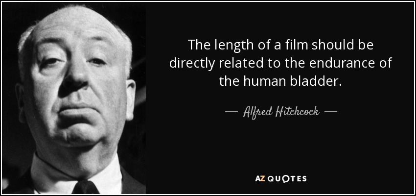

Are Movies Too LONG? 
========================================================

author: Alison Bradburn, Cristy Limones, Ashle Markey
date: December 6, 2021
autosize: true

Or is your attention span S        H        R       I      N     K    I   NG?
========================================================



Our Dataset
========================================================


```
Rows: 85,855
Columns: 22
$ imdb_title_id         <chr> "tt0000009", "tt0000574", "tt0001892", "tt000210~
$ title                 <chr> "Miss Jerry", "The Story of the Kelly Gang", "De~
$ original_title        <chr> "Miss Jerry", "The Story of the Kelly Gang", "De~
$ year                  <chr> "1894", "1906", "1911", "1912", "1911", "1912", ~
$ date_published        <chr> "1894-10-09", "1906-12-26", "1911-08-19", "1912-~
$ genre                 <chr> "Romance", "Biography, Crime, Drama", "Drama", "~
$ duration              <int> 45, 70, 53, 100, 68, 60, 85, 120, 120, 55, 121, ~
$ country               <chr> "USA", "Australia", "Germany, Denmark", "USA", "~
$ language              <chr> "None", "None", "", "English", "Italian", "Engli~
$ director              <chr> "Alexander Black", "Charles Tait", "Urban Gad", ~
$ writer                <chr> "Alexander Black", "Charles Tait", "Urban Gad, G~
$ production_company    <chr> "Alexander Black Photoplays", "J. and N. Tait", ~
$ actors                <chr> "Blanche Bayliss, William Courtenay, Chauncey De~
$ description           <chr> "The adventures of a female reporter in the 1890~
$ avg_vote              <dbl> 5.9, 6.1, 5.8, 5.2, 7.0, 5.7, 6.8, 6.2, 6.7, 5.5~
$ votes                 <int> 154, 589, 188, 446, 2237, 484, 753, 273, 198, 22~
$ budget                <chr> "", "$ 2250", "", "$ 45000", "", "", "", "ITL 45~
$ usa_gross_income      <chr> "", "", "", "", "", "", "", "", "", "", "", "", ~
$ worlwide_gross_income <chr> "", "", "", "", "", "", "", "", "", "", "", "", ~
$ metascore             <dbl> NA, NA, NA, NA, NA, NA, NA, NA, NA, NA, NA, NA, ~
$ reviews_from_users    <dbl> 1, 7, 5, 25, 31, 13, 12, 7, 4, 8, 9, 9, 16, 8, N~
$ reviews_from_critics  <dbl> 2, 7, 2, 3, 14, 5, 9, 5, 1, 1, 9, 28, 7, 23, 4, ~
```
Our Cleaned Data


```
Rows: 18,281
Columns: 6
$ original_title <chr> "Kate & Leopold", "The Plot Against Harry", "Malibu Hot~
$ year           <int> 2001, 1989, 1981, 1982, 1981, 1980, 1980, 1980, 1980, 1~
$ genre          <chr> "Comedy, Fantasy, Romance", "Comedy", "Comedy, Romance"~
$ duration       <int> 118, 81, 90, 100, 96, 88, 78, 101, 90, 78, 105, 86, 98,~
$ votes          <int> 77852, 280, 657, 599, 423, 247, 1823, 621, 338, 258, 66~
$ country        <chr> "USA", "USA", "USA", "USA", "USA", "USA", "USA", "USA",~
```
*data from IMDb, via Kaggle

Average Movie Times
========================================================


